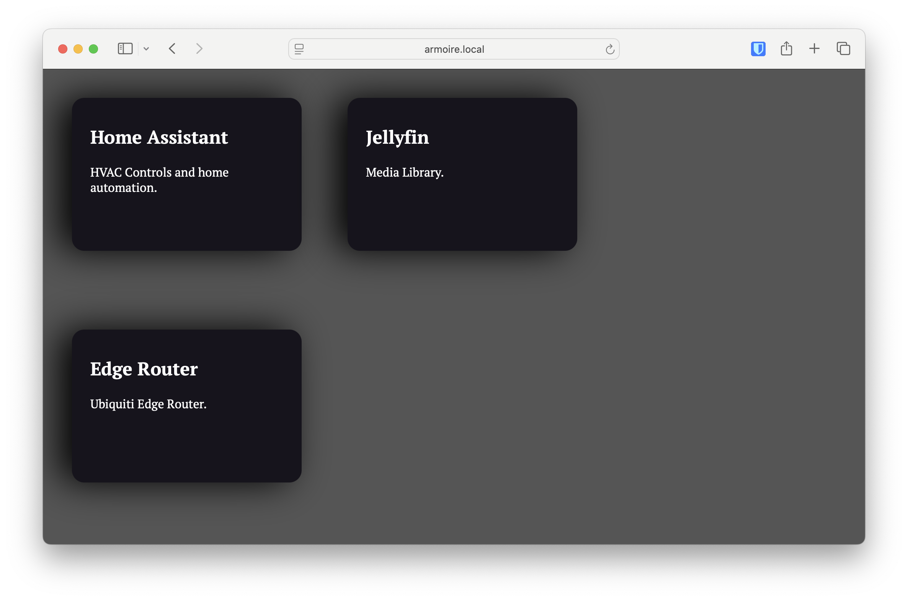

# Home Server Homepage

Simple and tiny app that provides an app launching page for your homeserver, where all the apps are running on various ports that you can never remember.

### "Features":

* Very small and fast enough.
* If you access your home server via different URLs, the app launch URLs will be relative to the hostname you are using (useful if you access via IP, local hostname, or over a tunnel like tailscale.)
* Can also link to full URLs, e.g. to other servers on your network or in the cloud.

### Config

Create a file `config.toml` (there's a sample in the repo and add one or more `[[link]]` sections).

Links come in two types:
1. Local, with optional port number. In this case the hostname from the request will be used to build the link.
2. URL - can be any URL, the hostname from the request is not used.

Links must also have a name and may have an optional sub-heading.

Example docker-compose.yml:
```
services:
  homepage:
    image: ghcr.io/werkshy/home-server-homepage:0.0.1
    restart: always
    ports:
      - 80:8000
    volumes:
      - ./homepage/config.toml:/config.toml:ro
```

Example config.toml:
```
[server]
port = 8000

[[link]]
title = "Home Assistant"
port = 8123
sub_heading = "HVAC Controls and home automation."

[[link]]
title = "Jellyfin"
port = 8096
sub_heading = "Media Library."

[[link]]
title = "Edge Router"
url = "https://192.168.1.1/"
sub_heading = "Ubiquiti Edge Router."
```

### Screenshots


